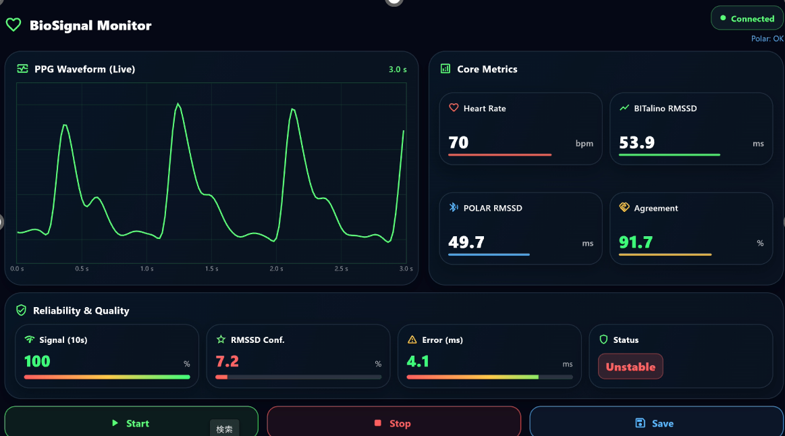

# HRV Monitoring Application

## Overview
This application was developed for wearable physiological sensing research.

It provides real-time visualization of heart rate variability (HRV) metrics using wearable sensors.

## Features

- Real-time heart rate display
- RMSSD calculation
- Signal quality monitoring
- IMU-based motion monitoring
- Flutter user interface
- Python backend

## Technologies

- Flutter
- Dart
- Python
- WebSocket
- BITalino
- Polar H10
- IMU Sensor

## Research

This project was developed as part of my research on motion-artifact-resilient HRV estimation using ear-lobe PPG signals.

Accepted Paper:
IEEE AIM 2026
Motion-Artifact-Resilient HRV Estimation Based on Signal Reliability Assessment for Facial PPG

## Screenshot

